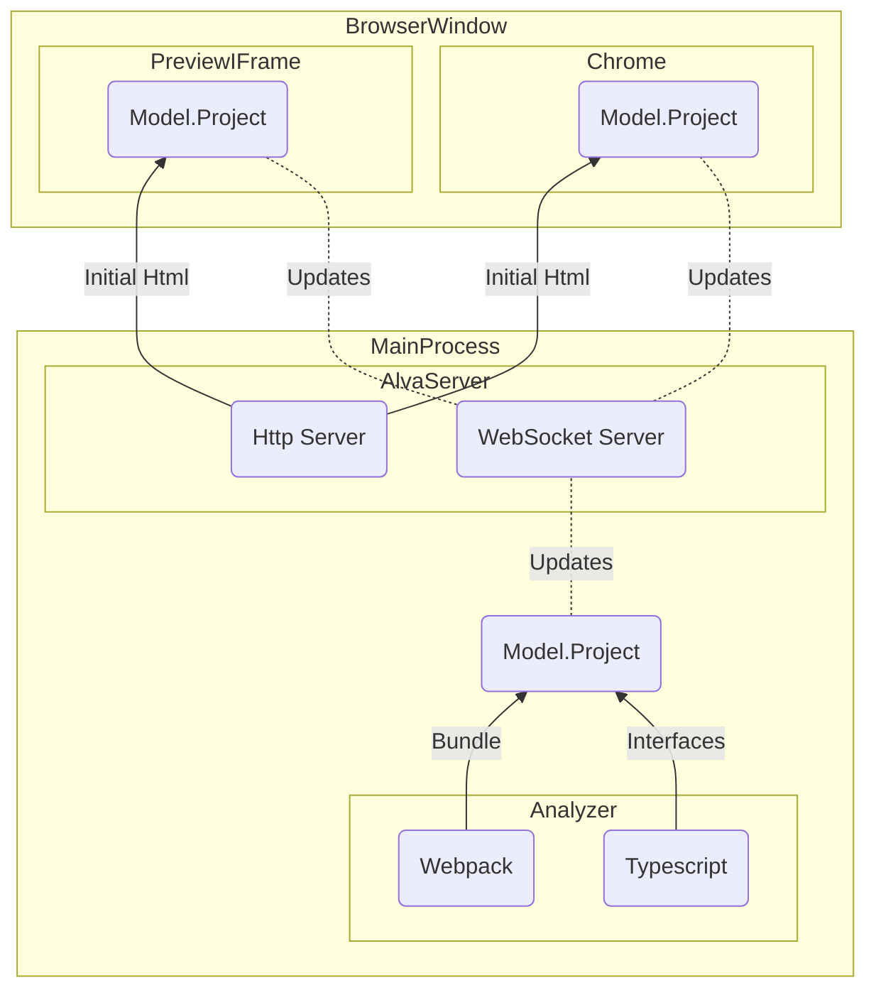

```mermaid
graph BT
    subgraph MainProcess
        mainContext(Model.Project)

        webpack-- Bundle -->mainContext
        ts-- Interfaces -->mainContext

        subgraph Analyzer
            webpack(Webpack)
            ts(Typescript)
        end

        subgraph AlvaServer
            http(Http Server)
            ws(WebSocket Server)
        end

        mainContext-. Updates .-ws
        
    end

    subgraph BrowserWindow
        subgraph Chrome
            clientContext(Model.Project)
            http-- Initial Html -->clientContext
            ws-. Updates .-clientContext
        end

        subgraph PreviewIFrame
            previewContext(Model.Project)
            http-- Initial Html -->previewContext
            ws-. Updates .-previewContext
        end
    end
```
