# Alva Data Flow
A diagram describing the technical data flow from the Alva application.

Click here to see the diagram on the [Mermaid Editor](https://mermaidjs.github.io/mermaid-live-editor/#/edit/eyJjb2RlIjoiZ3JhcGggQlRcbiAgICBzdWJncmFwaCBNYWluUHJvY2Vzc1xuICAgICAgICBtYWluQ29udGV4dChNb2RlbC5Qcm9qZWN0KVxuXG4gICAgICAgIHdlYnBhY2stLSBCdW5kbGUgLS0-bWFpbkNvbnRleHRcbiAgICAgICAgdHMtLSBJbnRlcmZhY2VzIC0tPm1haW5Db250ZXh0XG5cbiAgICAgICAgc3ViZ3JhcGggQW5hbHl6ZXJcbiAgICAgICAgICAgIHdlYnBhY2soV2VicGFjaylcbiAgICAgICAgICAgIHRzKFR5cGVzY3JpcHQpXG4gICAgICAgIGVuZFxuXG4gICAgICAgIHN1YmdyYXBoIEFsdmFTZXJ2ZXJcbiAgICAgICAgICAgIGh0dHAoSHR0cCBTZXJ2ZXIpXG4gICAgICAgICAgICB3cyhXZWJTb2NrZXQgU2VydmVyKVxuICAgICAgICBlbmRcblxuICAgICAgICBtYWluQ29udGV4dC0uIFVwZGF0ZXMgLi13c1xuICAgIGVuZFxuXG4gICAgc3ViZ3JhcGggQnJvd3NlcldpbmRvd1xuICAgICAgICBzdWJncmFwaCBDaHJvbWVcbiAgICAgICAgICAgIGNsaWVudENvbnRleHQoTW9kZWwuUHJvamVjdClcbiAgICAgICAgICAgIGh0dHAtLSBJbml0aWFsIEh0bWwgLS0-Y2xpZW50Q29udGV4dFxuICAgICAgICAgICAgd3MtLiBVcGRhdGVzIC4tY2xpZW50Q29udGV4dFxuICAgICAgICBlbmRcblxuICAgICAgICBzdWJncmFwaCBQcmV2aWV3SUZyYW1lXG4gICAgICAgICAgICBwcmV2aWV3Q29udGV4dChNb2RlbC5Qcm9qZWN0KVxuICAgICAgICAgICAgaHR0cC0tIEluaXRpYWwgSHRtbCAtLT5wcmV2aWV3Q29udGV4dFxuICAgICAgICAgICAgd3MtLiBVcGRhdGVzIC4tcHJldmlld0NvbnRleHRcbiAgICAgICAgZW5kXG5cbiAgICBlbmRcblxuICAgIHN0eWxlIHdlYnBhY2sgZmlsbDojRjQ3NDNCLHN0cm9rZTojNTQ1NDU0LHN0cm9rZS13aWR0aDoycHhcbiAgICBzdHlsZSB0cyBmaWxsOiNGNDc0M0Isc3Ryb2tlOiM1NDU0NTQsc3Ryb2tlLXdpZHRoOjJweFxuXG4gICAgc3R5bGUgaHR0cCBmaWxsOiNGMUY3RUQsc3Ryb2tlOiM1NDU0NTQsc3Ryb2tlLXdpZHRoOjJweFxuICAgIHN0eWxlIHdzIGZpbGw6I0YxRjdFRCxzdHJva2U6IzU0NTQ1NCxzdHJva2Utd2lkdGg6MnB4XG5cbiAgICBzdHlsZSBtYWluQ29udGV4dCBmaWxsOiMxN0JFQkIsc3Ryb2tlOiM1NDU0NTQsc3Ryb2tlLXdpZHRoOjJweFxuICAgIHN0eWxlIGNsaWVudENvbnRleHQgZmlsbDojMTdCRUJCLHN0cm9rZTojNTQ1NDU0LHN0cm9rZS13aWR0aDoycHhcbiAgICBzdHlsZSBwcmV2aWV3Q29udGV4dCBmaWxsOiMxN0JFQkIsc3Ryb2tlOiM1NDU0NTQsc3Ryb2tlLXdpZHRoOjJweFxuICAgIGxpbmtTdHlsZSA0IHN0cm9rZTojRERCRUM4LHN0cm9rZS13aWR0aDoycHgsc3Ryb2tlLWRhc2hhcnJheTogNSwgNVxuICAgIGxpbmtTdHlsZSA2IHN0cm9rZTojRERCRUM4LHN0cm9rZS13aWR0aDoycHgsc3Ryb2tlLWRhc2hhcnJheTogNSwgNSIsIm1lcm1haWQiOnsidGhlbWUiOiJkZWZhdWx0In19)

## SVG Diagram

## Mermaid Code (UML)

